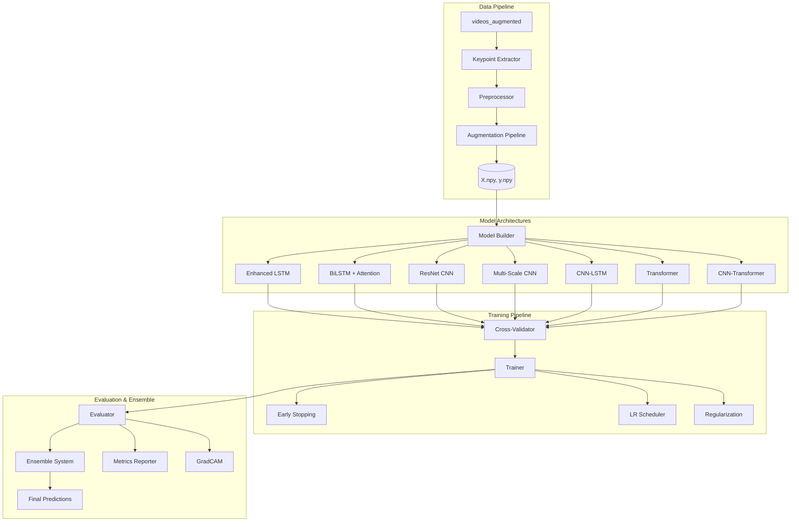

# Design Document: Gait ML Training Pipeline

## Overview

This design document describes a comprehensive ML training pipeline for gait-based person recognition achieving >95% accuracy without overfitting. The system uses MediaPipe pose keypoints from the videos_augmented dataset (13 persons, ~390 samples) and implements multiple deep learning architectures with advanced regularization, cross-validation, and ensemble methods.

The pipeline follows a modular architecture with clear separation between:
- Data preprocessing and augmentation
- Model building and training
- Cross-validation and evaluation
- Ensemble prediction
- Visualization and interpretability

## Architecture



## Components and Interfaces

### 1. Data Preprocessing Module

```python
class GaitDataPreprocessor:
    """Preprocesses video data into training-ready features"""
    
    def __init__(self, 
                 input_dir: str = "data/videos_augmented",
                 output_dir: str = "data/processed_augmented",
                 target_frames: int = 64,
                 include_angles: bool = True):
        pass
    
    def extract_keypoints(self, video_path: str) -> np.ndarray:
        """Extract MediaPipe pose keypoints from video
        Returns: (T, 33, 4) array of (x, y, z, visibility)
        """
        pass
    
    def normalize_sequence(self, keypoints: np.ndarray) -> np.ndarray:
        """Center on hip, scale by torso length
        Returns: (T, 33, 2) normalized (x, y) coordinates
        """
        pass
    
    def compute_joint_angles(self, keypoints: np.ndarray) -> np.ndarray:
        """Compute 4 joint angles (knees, elbows)
        Returns: (T, 4) angles in radians
        """
        pass
    
    def resample_sequence(self, features: np.ndarray, target_len: int) -> np.ndarray:
        """Resample to fixed length using linear interpolation
        Returns: (target_len, D) resampled features
        """
        pass
    
    def process_all_videos(self) -> Tuple[np.ndarray, np.ndarray, dict]:
        """Process all videos in input directory
        Returns: X (N, 64, 70), y (N,), labels_map
        """
        pass
```

### 2. Data Augmentation Module

```python
class GaitAugmentation:
    """Gait-specific data augmentation"""
    
    def temporal_warp(self, sequence: np.ndarray, 
                      warp_factor: float = 0.2) -> np.ndarray:
        """Non-uniform temporal warping
        Preserves sequence length, varies local speed
        """
        pass
    
    def magnitude_scale(self, sequence: np.ndarray,
                        scale_range: Tuple[float, float] = (0.9, 1.1)) -> np.ndarray:
        """Scale joint angles by random factor"""
        pass
    
    def add_gaussian_noise(self, sequence: np.ndarray,
                           std: float = 0.01) -> np.ndarray:
        """Add Gaussian noise to coordinates"""
        pass
    
    def mixup(self, seq1: np.ndarray, seq2: np.ndarray,
              alpha: float = 0.2) -> Tuple[np.ndarray, np.ndarray]:
        """Mixup two sequences with interpolated labels"""
        pass
    
    def augment_batch(self, X: np.ndarray, y: np.ndarray,
                      augment_factor: int = 2) -> Tuple[np.ndarray, np.ndarray]:
        """Apply all augmentations to increase dataset size"""
        pass
```

### 3. Model Builder Module

```python
class EnhancedGaitModelBuilder:
    """Builds all model architectures for gait recognition"""
    
    def __init__(self,
                 sequence_length: int = 64,
                 num_features: int = 70,
                 num_classes: int = 13,
                 l2_reg: float = 0.001,
                 label_smoothing: float = 0.1):
        pass
    
    def build_enhanced_lstm(self, 
                            units: List[int] = [128, 64, 32],
                            dropout: float = 0.3,
                            recurrent_dropout: float = 0.2) -> Model:
        """3-layer LSTM with recurrent dropout and L2 regularization"""
        pass
    
    def build_enhanced_bilstm(self,
                              units: List[int] = [64, 32],
                              dropout: float = 0.3) -> Model:
        """Bidirectional LSTM with attention pooling"""
        pass
    
    def build_resnet_cnn(self,
                         filters: List[int] = [64, 128, 256],
                         dropout: float = 0.3) -> Model:
        """ResNet-style 1D CNN with skip connections"""
        pass
    
    def build_multiscale_cnn(self,
                             base_filters: int = 64,
                             dropout: float = 0.3) -> Model:
        """Multi-scale CNN with parallel convolutions (3, 5, 7 kernels)"""
        pass
    
    def build_enhanced_cnn_lstm(self,
                                cnn_filters: int = 64,
                                lstm_units: int = 64,
                                dropout: float = 0.3) -> Model:
        """CNN-LSTM hybrid with bidirectional LSTM and attention"""
        pass
    
    def build_enhanced_transformer(self,
                                   d_model: int = 128,
                                   num_heads: int = 8,
                                   num_layers: int = 3,
                                   dropout: float = 0.3) -> Model:
        """Transformer with sinusoidal positional encoding"""
        pass
    
    def build_cnn_transformer_v2(self,
                                 cnn_filters: int = 64,
                                 d_model: int = 128,
                                 num_heads: int = 4,
                                 dropout: float = 0.3) -> Model:
        """CNN-Transformer hybrid"""
        pass
    
    def build_all_models(self) -> Dict[str, Model]:
        """Build all available architectures"""
        pass
```

### 4. Cross-Validation Module

```python
class StratifiedCrossValidator:
    """Stratified k-fold cross-validation with repetitions"""
    
    def __init__(self,
                 n_splits: int = 5,
                 n_repeats: int = 3,
                 random_state: int = 42):
        pass
    
    def split(self, X: np.ndarray, y: np.ndarray) -> Iterator[Tuple]:
        """Generate stratified train/val splits
        Yields: (train_idx, val_idx) for each fold
        """
        pass
    
    def cross_validate(self,
                       model_builder: Callable,
                       X: np.ndarray,
                       y: np.ndarray,
                       epochs: int = 100,
                       batch_size: int = 32) -> Dict:
        """Run full cross-validation
        Returns: {fold_metrics, mean_metrics, std_metrics}
        """
        pass
    
    def get_fold_statistics(self, results: Dict) -> Dict:
        """Compute mean and std across all folds"""
        pass
```

### 5. Model Trainer Module

```python
class GaitModelTrainer:
    """Trains models with regularization and callbacks"""
    
    def __init__(self,
                 models_dir: str = "models",
                 results_dir: str = "results",
                 tensorboard_dir: str = "results/logs"):
        pass
    
    def get_callbacks(self,
                      model_name: str,
                      patience: int = 15,
                      lr_patience: int = 5) -> List[Callback]:
        """Get training callbacks
        - EarlyStopping (patience=15-20, restore_best_weights=True)
        - ReduceLROnPlateau (factor=0.5, patience=5)
        - ModelCheckpoint
        - TensorBoard
        """
        pass
    
    def train_model(self,
                    model: Model,
                    X_train: np.ndarray,
                    y_train: np.ndarray,
                    X_val: np.ndarray,
                    y_val: np.ndarray,
                    epochs: int = 100,
                    batch_size: int = 32) -> History:
        """Train single model with callbacks"""
        pass
    
    def train_all_models(self,
                         X: np.ndarray,
                         y: np.ndarray,
                         use_cv: bool = True) -> Dict:
        """Train all architectures with cross-validation"""
        pass
```

### 6. Ensemble Module

```python
class GaitEnsemble:
    """Ensemble methods for combining multiple models"""
    
    def __init__(self, models: List[Model], weights: List[float] = None):
        pass
    
    def soft_vote(self, X: np.ndarray) -> np.ndarray:
        """Average probability distributions
        Returns: (N, num_classes) averaged probabilities
        """
        pass
    
    def weighted_vote(self, X: np.ndarray) -> np.ndarray:
        """Weighted average based on validation performance
        Returns: (N, num_classes) weighted probabilities
        """
        pass
    
    def predict(self, X: np.ndarray) -> Dict:
        """Make ensemble prediction
        Returns: {ensemble_pred, ensemble_proba, individual_preds}
        """
        pass
    
    def fit_stacking(self,
                     X_train: np.ndarray,
                     y_train: np.ndarray,
                     meta_learner: str = "logistic") -> None:
        """Train meta-learner for stacking"""
        pass
```

### 7. Metrics and Evaluation Module

```python
class GaitMetricsEvaluator:
    """Comprehensive metrics computation and reporting"""
    
    def __init__(self, num_classes: int = 13, class_names: List[str] = None):
        pass
    
    def compute_all_metrics(self,
                            y_true: np.ndarray,
                            y_pred: np.ndarray,
                            y_proba: np.ndarray) -> Dict:
        """Compute all metrics
        Returns: {accuracy, precision, recall, f1_macro, f1_weighted,
                  roc_auc, per_class_metrics, confusion_matrix}
        """
        pass
    
    def compute_roc_auc(self,
                        y_true: np.ndarray,
                        y_proba: np.ndarray) -> float:
        """Compute one-vs-rest ROC-AUC"""
        pass
    
    def generate_confusion_matrix(self,
                                  y_true: np.ndarray,
                                  y_pred: np.ndarray) -> np.ndarray:
        """Generate 13x13 confusion matrix"""
        pass
    
    def generate_roc_curves(self,
                            y_true: np.ndarray,
                            y_proba: np.ndarray,
                            save_path: str) -> None:
        """Generate and save ROC curves for all classes"""
        pass
    
    def generate_pr_curves(self,
                           y_true: np.ndarray,
                           y_proba: np.ndarray,
                           save_path: str) -> None:
        """Generate and save precision-recall curves"""
        pass
    
    def save_metrics_json(self, metrics: Dict, path: str) -> None:
        """Save metrics to JSON file"""
        pass
    
    def generate_training_plots(self, history: History, save_path: str) -> None:
        """Generate loss/accuracy vs epochs plots"""
        pass
```

### 8. GradCAM Visualization Module

```python
class GaitGradCAM:
    """GradCAM visualization for model interpretability"""
    
    def __init__(self, model: Model, layer_name: str = None):
        pass
    
    def compute_gradcam(self,
                        input_sequence: np.ndarray,
                        class_idx: int = None) -> np.ndarray:
        """Compute GradCAM heatmap for temporal sequence
        Returns: (sequence_length,) importance weights
        """
        pass
    
    def visualize_temporal_importance(self,
                                      sequence: np.ndarray,
                                      heatmap: np.ndarray,
                                      save_path: str) -> None:
        """Visualize which frames are most important"""
        pass
    
    def get_attention_weights(self, model: Model, X: np.ndarray) -> np.ndarray:
        """Extract attention weights from Transformer models"""
        pass
```

## Data Models

### Input Data Structure
```python
# Raw video: data/videos_augmented/{Person}/{F|S}/{Person}_{View}{N}_{aug}.mp4
# Example: data/videos_augmented/Aarav/F/Aarav_F1_aug3_brightness.mp4

# Extracted keypoints per frame: (33, 4) - 33 landmarks, (x, y, z, visibility)
# Normalized features per frame: (70,) - 66 coords + 4 angles
# Full sequence: (64, 70) - 64 frames, 70 features

# Dataset arrays:
X: np.ndarray  # Shape: (N, 64, 70) - N samples
y: np.ndarray  # Shape: (N,) - class labels 0-12
labels_map: Dict[str, int]  # {"Aarav": 0, "Ananya": 1, ...}
```

### Model Output Structure
```python
# Single model prediction
prediction: np.ndarray  # Shape: (N, 13) - probabilities per class

# Ensemble prediction
ensemble_result: Dict = {
    "ensemble_pred": np.ndarray,      # (N,) predicted classes
    "ensemble_proba": np.ndarray,     # (N, 13) averaged probabilities
    "individual_preds": List[np.ndarray],  # List of (N, 13) per model
    "confidence": np.ndarray          # (N,) max probability
}
```

### Metrics Output Structure
```python
metrics: Dict = {
    "accuracy": float,
    "precision_macro": float,
    "precision_weighted": float,
    "recall_macro": float,
    "recall_weighted": float,
    "f1_macro": float,
    "f1_weighted": float,
    "roc_auc": float,
    "confusion_matrix": List[List[int]],  # 13x13
    "per_class": {
        "Aarav": {"precision": float, "recall": float, "f1": float},
        # ... for all 13 classes
    },
    "cross_validation": {
        "fold_accuracies": List[float],
        "mean_accuracy": float,
        "std_accuracy": float
    }
}
```

## Correctness Properties

*A property is a characteristic or behavior that should hold true across all valid executions of a system—essentially, a formal statement about what the system should do. Properties serve as the bridge between human-readable specifications and machine-verifiable correctness guarantees.*

### Property 1: Preprocessing Invariants
*For any* input video sequence with T frames, the preprocessed output SHALL have exactly 64 frames and 70 features per frame, regardless of original sequence length.
**Validates: Requirements 1.3, 1.4**

### Property 2: Normalization Consistency
*For any* input keypoint sequence, after hip-centered normalization, the mid-hip position SHALL be at origin (0, 0) for all frames, and coordinates SHALL be scaled by torso length.
**Validates: Requirements 1.2**

### Property 3: Model Compilation Configuration
*For any* model built by the Model_Builder, the optimizer SHALL be AdamW with weight decay, and metrics SHALL include accuracy, precision, recall, and AUC.
**Validates: Requirements 2.8, 2.9**

### Property 4: Regularization Bounds
*For any* model architecture, dropout rates SHALL be between 0.2-0.5, and L2 regularization coefficient SHALL be between 0.0001-0.001.
**Validates: Requirements 3.2, 3.3**

### Property 5: Augmentation Validity
*For any* augmented sequence, the output SHALL have the same shape as input (64, 70), and magnitude-scaled angles SHALL be within 0.9-1.1x of original values.
**Validates: Requirements 4.1, 4.2, 4.3, 4.4**

### Property 6: Cross-Validation Stratification
*For any* k-fold split, each fold SHALL contain samples from all 13 classes, and class proportions SHALL match the overall dataset distribution within tolerance.
**Validates: Requirements 5.1, 5.4**

### Property 7: Ensemble Prediction Consistency
*For any* input batch, the ensemble soft-vote output SHALL equal the arithmetic mean of individual model probability outputs.
**Validates: Requirements 6.1, 6.4**

### Property 8: Metrics Completeness
*For any* evaluation run, the metrics output SHALL contain accuracy, precision, recall, F1 (macro and weighted), ROC-AUC, and a 13x13 confusion matrix.
**Validates: Requirements 7.1, 7.2, 7.3, 7.4**

## Error Handling

### Data Errors
- **Missing video files**: Log warning, skip file, continue processing
- **MediaPipe detection failure**: Return None, exclude sample from dataset
- **Insufficient frames (<10)**: Log warning, exclude sample
- **Invalid keypoint values (NaN)**: Interpolate from neighboring frames or exclude

### Training Errors
- **GPU memory overflow**: Reduce batch size automatically, retry
- **NaN loss**: Stop training, restore last checkpoint, reduce learning rate
- **Validation accuracy plateau**: Trigger early stopping after patience epochs
- **Model divergence**: Log error, skip model, continue with others

### Evaluation Errors
- **Single class in fold**: Log warning, use accuracy only (skip ROC-AUC)
- **Empty predictions**: Return error metrics, flag for review

## Testing Strategy

### Unit Tests
- Test keypoint extraction on sample video
- Test normalization produces centered, scaled output
- Test resampling produces correct output length
- Test each model architecture builds without errors
- Test metrics computation with known inputs
- Test augmentation preserves sequence shape

### Property-Based Tests (using Hypothesis)
- **Property 1**: Generate random sequences, verify output shape (64, 70)
- **Property 2**: Generate random keypoints, verify hip-centered output
- **Property 3**: Build random models, verify optimizer and metrics
- **Property 4**: Build models, verify dropout and L2 bounds
- **Property 5**: Generate sequences, apply augmentation, verify shape and bounds
- **Property 6**: Generate datasets, split, verify class distribution
- **Property 7**: Generate predictions, verify ensemble averaging
- **Property 8**: Generate predictions, verify metrics completeness

### Integration Tests
- End-to-end pipeline: video → preprocessing → training → evaluation
- Cross-validation produces consistent fold results
- Ensemble improves over individual models
- Model saving and loading preserves predictions

### Testing Configuration
- Property tests: minimum 100 iterations per property
- Use pytest with hypothesis for property-based testing
- Tag format: **Feature: gait-ml-training, Property {N}: {description}**
